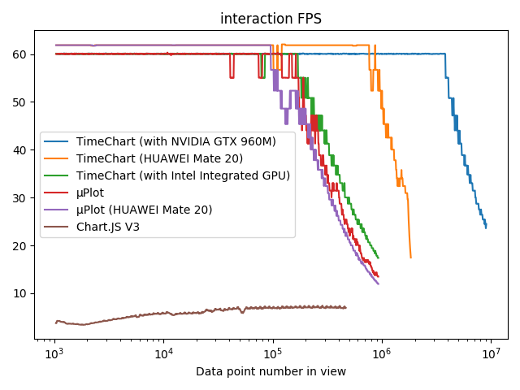
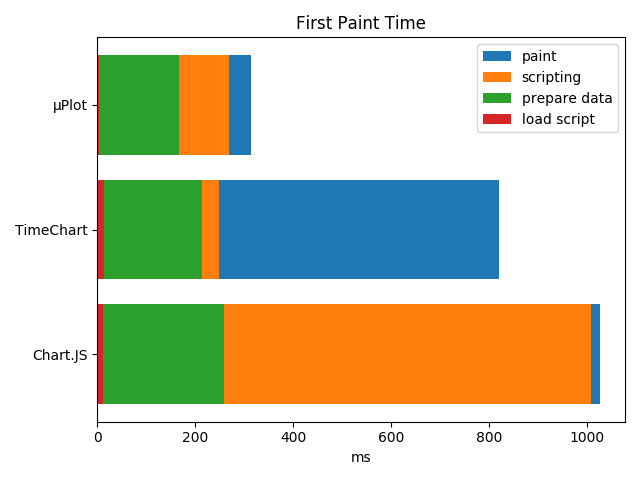
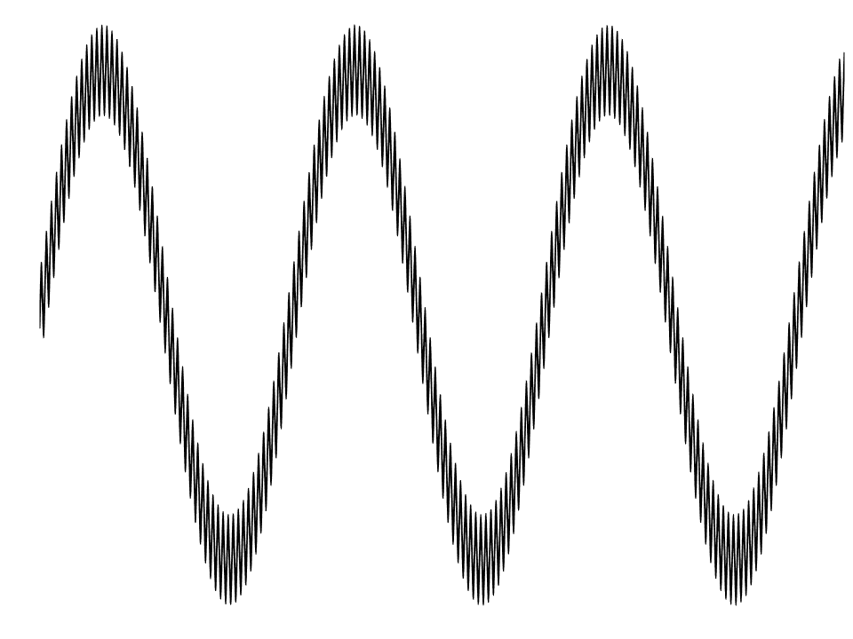
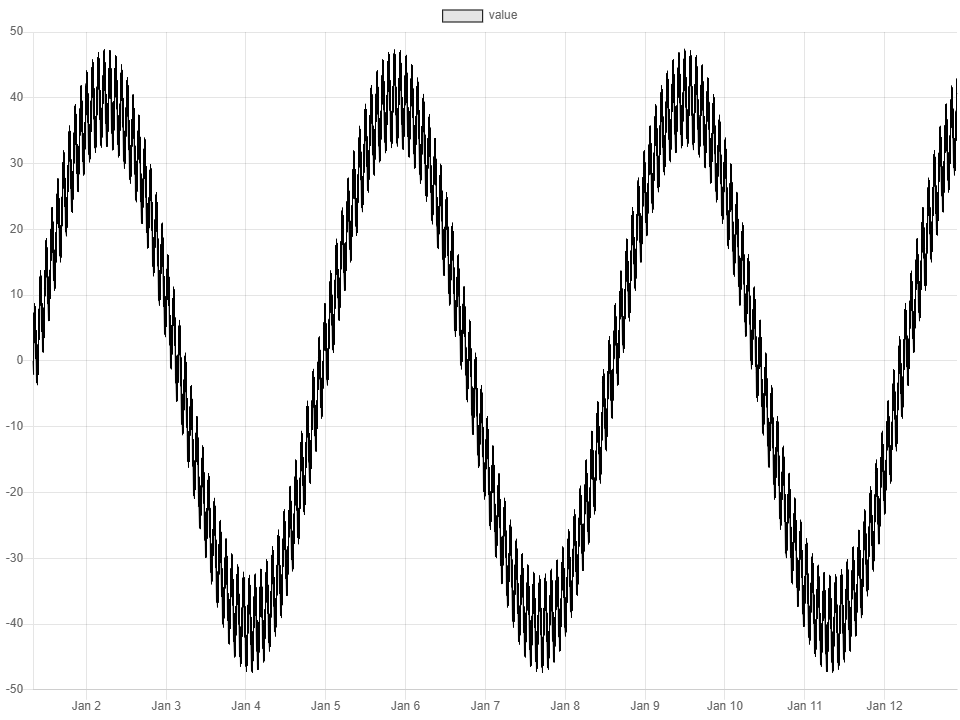
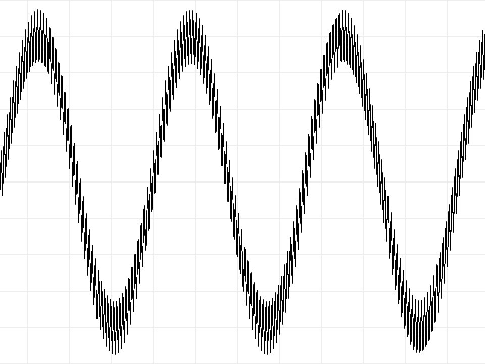

# Performance Tests

Enviroment: All tests run on my laptop
* CPU: Intel i7-6700HQ
* Memory: 16GB
* Browser: Chrome 80

Tested libraries:
* timechart: this repo, based on WebGL.
* [μPlot](https://github.com/leeoniya/uPlot): An exceptionally fast, tiny time series & line chart
* [Chart.JS](https://github.com/chartjs/Chart.js): Simple yet flexible JavaScript charting for designers & developers. In the tests, the unreleased version V3 is used.

All test code is available in `benchmark` folder in this repo.

## Interaction

This tests the FPS when user is interacting with chart (pan / zoom).

This is the most exciting feature of TimeChart. All data is loaded into GPU memory. Almost all calculation required by pan or zoom is done by GPU, really fast.

This test simulates user zooming in the chart 1000 frames.

Method:
* Open test page in Chrome in-private window (effectively disable all extensions)
* Wait animation to finish, copy output from console.

Result:

Using Intel integrated GPU, TimeChart performs slightly better than μPlot. Chart.JS is much slower, and it spent time on not rendered points. Using NVIDIA GPU, TimeChart is able to render 20x more data points than μPlot at 60 FPS. On mobile deivce (HUAWEI Mate 20 Android phone), TimeChart also performs better.

Note that TimeChart renders every data points and results in smoother image. See [Render Comparation](#render-comparation)

## First Paint Test

This test measures how long it will take for an chart to be ready since page start loading.

1M generated data points are provided to each library.

Method:
* Open test page in an Chrome in-private window (effectively disable all extensions), see it renders correctly.
* In chrome dev-tools performance tab, disable JavaScript samples.
* Click "Start profiling and reload page".
* Verify all network requests hit memory cache.
* Record 4 manual timestamp from "event log" and the timestamp of "First Meaningful Paint".
* Repeat 3 times for each test.

Result:

μPlot is really fast. TimeChart rendering is async, so the scripting time is very short. TimeChart is not very good at this, WebGL initialization takes more time.

## Render Comparation

μPlot and Chart.JS downsamples data on the fly, while TimeChart renders every points. Taking advantages of this and GPU anti-aliasing, TimeChart renders smoother images. The following are images rendered in canvas.

TimeChart:

Chart.JS:

μPlot:

